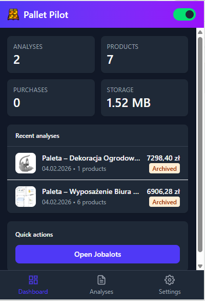
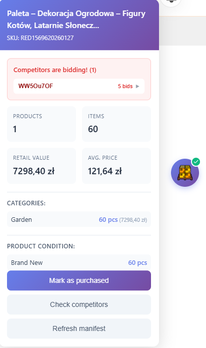
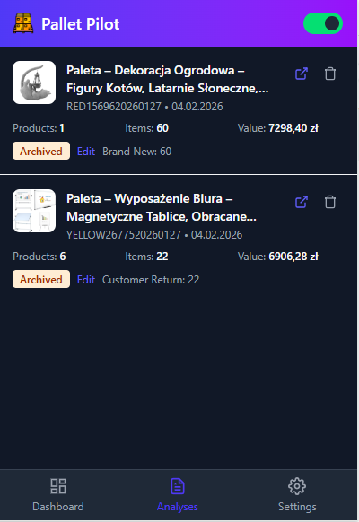
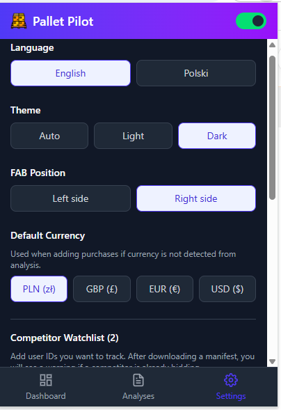

# Pallet Pilot

> **Chrome extension for analyzing and tracking pallet manifests from liquidation auctions**

Pallet Pilot helps resellers make informed purchasing decisions by automatically analyzing Excel manifests from pallet auctions. Track your purchases, monitor competitors, and manage your inventory - all from a clean, intuitive interface.

## Features

### Manifest Analysis
Automatically download and analyze Excel manifests directly from auction pages. Get instant insights into:
- **Product count** and total quantity
- **Estimated retail value** and average price per item
- **Category breakdown** with item counts
- **Product condition** distribution (Brand New, Customer Returns, etc.)

### Floating Action Button (FAB)
Non-intrusive overlay that appears on supported auction pages:
- One-click manifest download and analysis
- Quick summary of pallet contents
- Mark palettes as purchased with custom price
- Check for competitor bids from your watchlist

### Purchase Tracking
Keep track of all your pallet purchases:
- Record purchase prices
- View profit/loss calculations
- Track sales and inventory

### Competitor Watchlist
Monitor specific bidders across auctions:
- Add user IDs to your watchlist
- Get alerts when watched competitors bid on pallets you're viewing
- Stay ahead of the competition

### Multi-language Support
Full internationalization with support for:
- 🇬🇧 English
- 🇵🇱 Polski

### Customization
- **Theme:** Light, Dark, or Auto (follows system)
- **FAB Position:** Left or right side of screen
- **Default Currency:** PLN, GBP, EUR, USD

## Installation

1. Download the latest release ZIP from [Releases](../../releases)
2. Unzip to a folder on your computer
3. Open Chrome and navigate to `chrome://extensions`
4. Enable **Developer mode** (toggle in top right)
5. Click **Load unpacked** and select the unzipped folder
6. The Pallet Pilot icon should appear in your toolbar

## Usage

1. **Navigate** to a supported auction page
2. **Click** the floating button (FAB) on the right side
3. **Download** the manifest to analyze the pallet
4. **Review** the summary: products, value, categories, conditions
5. **Mark as purchased** if you win the auction
6. **Track** your purchases and profits in the popup

## Supported Sites

- Jobalots.com (liquidation auctions)

## Privacy & Data Storage

Pallet Pilot stores all data **locally** in your browser using **IndexedDB**:
- No account required
- No cloud sync - your data never leaves your device
- No tracking or analytics
- All analyses, purchases, and settings stored in browser's IndexedDB
- Data persists until you clear browser data or uninstall the extension

## Screenshots

| Dashboard | FAB Panel | Analyses | Settings |
|:---------:|:---------:|:--------:|:--------:|
|  |  |  |  |

## Changelog

See [CHANGELOG.md](CHANGELOG.md) for version history.

## License

This project is provided for personal use only. All rights reserved.

---

**Made with ❤️**
